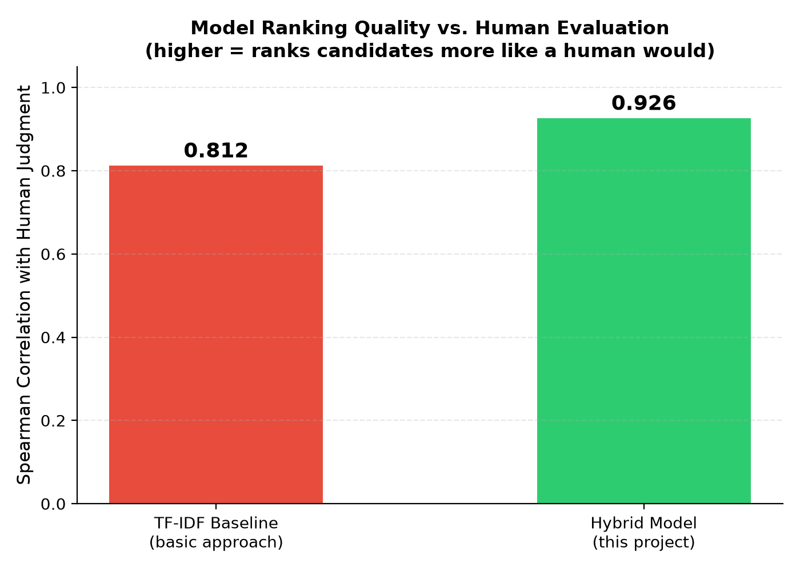

# AI Resume Screening System

This is my project for the internship — an AI-powered tool that screens resumes against a job description and ranks candidates automatically. I didn't want to just build the basic version everyone does (keyword matching + cosine similarity), so I tried to make it actually useful and explainable, and then tested whether it's genuinely better than the standard approach.

## The problem I was solving

Recruiters get hundreds of resumes per job opening and have to manually go through each one comparing it to the job description. It's slow, repetitive, and honestly easy to miss good candidates just from fatigue. The idea here is to build something that helps a recruiter shortlist faster without replacing their judgment.

## What I focused on

Most basic resume screeners just do TF-IDF + cosine similarity and call it done. I wanted to go a bit further:

- Instead of one similarity score, I combined four things: semantic meaning (using sentence embeddings), skill match (with must-have vs nice-to-have weighted differently), experience match, and education match
- For every skill match, the app shows the actual sentence from the resume that proves it — not just "matched: python" but the real line it came from
- I added a bias-reduction mode that hides candidate names, so you can check if the ranking changes
- There's a "Talent Pool Insights" section that shows which required skills are hardest to find across the whole batch of candidates, which I think is more useful to a recruiter than just seeing individual scores again
- Scoring priorities (Balanced / Skills-Focused / Experience-Focused) can be adjusted depending on what matters more for a specific role

## Does it actually work better? (this is the part I'm proud of)

I didn't want to just claim my approach is better without checking, so I manually went through 18 resumes myself and scored each one 1-5 based on how well I thought they fit a Data Analyst job description. Then I compared two things against my own scoring: my hybrid model, and a basic TF-IDF + cosine similarity approach (the "everyone does this" baseline).

| Approach | Correlation with my judgment (Spearman) |
|---|---|
| Basic TF-IDF baseline | 0.812 |
| My hybrid model | **0.926** |

My model's ranking matched my own human judgment about 14% more closely than the basic approach. I know 18 resumes for one role isn't a huge dataset, but at least it's a real, honest comparison rather than just assuming the more complex model is better. The raw numbers are in `data/evaluation_results.csv` if you want to check, and you can rerun the whole thing with `src/evaluate.py`.

## How it's built

1. **`jd_parser.py`** reads the job description text and pulls out required skills, minimum experience, and minimum education
2. **`resume_parser.py`** reads each resume (PDF/DOCX) and pulls out name, skills, education, and experience years
3. **`matcher.py`** takes both of those and combines semantic similarity, skill match, experience match, and education match into one weighted score, along with evidence for each matched skill
4. **`dashboard.py`** (the Streamlit app) displays the ranked table, charts, and insights

## Features

- Upload a job description and multiple resumes (PDF or DOCX) at once
- Get a ranked, color-coded table of candidates
- See exactly why each candidate scored the way they did (evidence from their actual resume text)
- Score comparison chart, sorted so the best candidates are easy to spot
- Talent pool insights — which skills are missing across candidates, overall quality of the pool, best candidate per required skill
- Option to hide names to check for bias in ranking
- Export results as CSV

## Tech stack

Python, spaCy (for name extraction), sentence-transformers (`all-MiniLM-L6-v2` for semantic similarity), pdfplumber and python-docx (for reading resumes), scikit-learn and scipy (for the evaluation/baseline comparison), pandas, Streamlit (for the actual app), and Altair for the charts.

## How to run it
python -m venv venv
venv\Scripts\activate
pip install spacy pdfplumber python-docx sentence-transformers scikit-learn pandas streamlit openpyxl altair scipy matplotlib
python -m spacy download en_core_web_sm
streamlit run app/dashboard.py

Then just paste a job description, upload some resumes, and click Rank Candidates.

To rerun the evaluation:
cd src
python evaluate.py

## Folder structure

- `app/dashboard.py` — the actual web app
- `src/resume_parser.py` — reads resumes
- `src/jd_parser.py` — reads job descriptions
- `src/matcher.py` — the scoring logic
- `src/evaluate.py` — evaluation against human judgment
- `src/plot_evaluation.py` — makes the comparison chart
- `data/resumes/` — resume files
- `data/evaluation_results.csv` — evaluation output
- `data/evaluation_comparison.png` — evaluation chart image

## Where this falls short (being honest about it)

- The skill and education extraction is basically keyword matching against a list I made — it's not a trained model, so it'll miss anything phrased in a way I didn't anticipate
- I tested this mostly on clean, well-formatted resumes. Real resumes with weird formatting, tables, or scanned PDFs would probably break the parser in places
- 18 resumes is a decent test but it's not a huge dataset, and it was just for one job role — I'd want to test this against more roles and more resumes if I had more time
- It's a single-session tool right now, nothing gets saved between runs, and there's no login/multi-user setup
- The bias check is just hiding names — a proper fairness check would look at a lot more than that

If I had more time I'd want to replace the keyword-based skill extraction with an actual trained model, test on a bigger and messier real-world dataset, and add some way to save results between sessions instead of starting fresh every time.

## Notes

This was built for an internship training task. The main thing I wanted to prove wasn't just "I can build an app" but that the extra complexity (semantic scoring, evidence, weighting) actually makes the ranking better, not just more complicated — which is why the evaluation section matters more to me than any of the individual features.